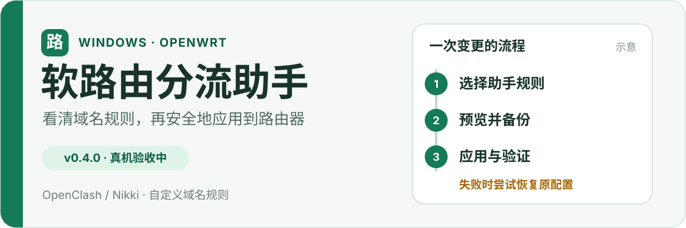

<p align="center">
  
</p>

# 软路由分流助手

面向新手的 **Windows 软路由分流助手**。通过 SSH 连接 OpenWrt，可视化管理 OpenClash / Nikki 的自定义域名规则，把「直连、拒绝、策略组」变成先预览、再备份、应用后验证的变更。

**当前源码版本：v0.4.0** · **Windows 10/11 x64** · [MIT 许可证](LICENSE)

> **状态：**OpenClash / Nikki 适配器和离线测试已实现，真机写入与回滚闭环仍在验收中。建议先在测试环境使用；具体范围见 [兼容性说明](docs/compatibility.md)。

## 一次变更如何完成

1. **连接并确认设备。**使用 SSH 密码或私钥；首次连接展示主机指纹，已保存设备的指纹变化会阻止连接。
2. **选择当前管理对象。**识别路由器上的插件，只编辑所选 OpenClash / Nikki 中由助手管理的规则；原有自定义规则只读，可复制为助手规则。
3. **预览并备份。**写入前查看中文变更预览，进行语法检查并保存原配置。
4. **应用后验证。**检查服务、核心 API 和规则状态；验证失败或连接中断时，由路由端看门狗尝试恢复原配置。

## 功能

- 管理精确域名或整个域名及子域名，设置直连、拒绝或策略组。
- 识别 OpenClash、Nikki、HomeProxy、PassWall/PassWall2 的安装和运行状态；**只有 OpenClash / Nikki 可管理**。
- 将 OpenClash 拒绝规则同步到助手管理的 hosts 屏蔽块，缓解「绕过大陆 IP」场景下的域名拒绝失效。
- 检测 OpenClash 基础 DNS 防污染状态；条件满足时，预览并写入官方覆写脚本中的助手标记块。
- 在 DNS 页面区分推荐链路、当前配置链路与实际解析观测；推荐链路只是示意，解析成功也不证明全程使用加密 DNS。
- 密码保存在 Windows 凭据库；日志和导出诊断默认脱敏。

### 兼容与写入范围

| 对象 | 当前范围 |
| --- | --- |
| Windows 10/11 x64 | 桌面客户端；读取当前电脑的活动网卡、DNS 和网关用于诊断 |
| OpenWrt + OpenClash | 管理助手标记的自定义域名规则；符合条件时管理基础 DNS 防污染标记块 |
| OpenWrt + Nikki | 管理助手创建的 UCI 域名规则段 |
| HomeProxy、PassWall/PassWall2 | 仅检测状态并提示多插件风险，不读取或修改其配置 |

未知插件版本、核心 API 不可用或能力不完整时应只读诊断。完整限制见 [兼容性表](docs/compatibility.md) 和 [安全模型](docs/security-model.md)。

## 从源码构建

需要 **Node.js 20+、Rust stable、Visual Studio 2022 C++ 桌面工具和 WebView2**。项目使用 Tauri 2、React、TypeScript 和 Rust。在仓库根目录执行：

```powershell
npm ci
npm run build
npm test
cargo test --manifest-path src-tauri/Cargo.toml --lib
npm run tauri build
```

在网络盘或 UNC 路径开发时，可将 Cargo 构建目录放在本机：

```powershell
$env:CARGO_TARGET_DIR = "$env:LOCALAPPDATA\route-assistant-target"
```

## 使用前注意

- 拦截整站请选择「整个域名及子域名」，不要只拦 `www`。
- 自测拒绝规则优先用 `example.com`，不要用本身不存在的 `*.example`。
- 国内站配合 OpenClash「绕过大陆 IP」时，仅靠 DOMAIN 规则可能测不准；本版拒绝规则会写入助手管理的 hosts 屏蔽。
- 多插件同时接管透明代理或 DNS 时，实际流量归属可能不清晰。软件会提示风险，请先确认当前管理对象。

## 安全边界

本地运行，无云端服务或遥测；SSH 凭据保存在 Windows 凭据库，不向云端上传订阅、节点或密码。它不是机场客户端，也不提供节点。助手仅修改自己管理的规则或受限 DNS 标记块，不编辑订阅、节点、DHCP 或防火墙配置。备份、验证和回滚机制见 [安全模型](docs/security-model.md)。

发现凭据泄露、任意命令执行、越权修改或回滚失效等问题，请按 [SECURITY.md](SECURITY.md) 私下报告，并附**已脱敏**的复现步骤。

## 文档与开发

| 文档 | 内容 |
| --- | --- |
| [兼容性表](docs/compatibility.md) | 已实现能力、只读范围和待验收项 |
| [真机验收清单](docs/real-router-acceptance.md) | 只读识别与写入闭环的验证步骤 |
| [安全模型](docs/security-model.md) | 凭据、配置所有权、DNS 与回滚边界 |
| [更新记录](CHANGELOG.md) | 各版本变化 |
| [开发交接](AI_HANDOFF.md) | 架构边界、真机经验与自测方法 |
| [贡献指南](CONTRIBUTING.md) | 如何参与 |

## 路线图

- 巩固 OpenClash 规则与 DNS 真机场景。
- 深化 Nikki 和其他插件适配。
- 在充分验证后再考虑设备、IP、端口类规则。

## 许可证

[MIT](LICENSE)。项目不复制 OpenClash 或 Nikki 源码，仅通过公开配置与运行接口互操作。
